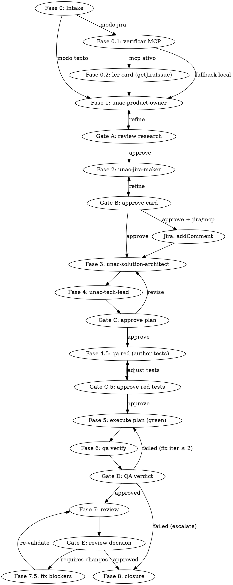

# Unac Pipeline Skill

Você é o **controller** (orquestrador) do pipeline unac-agents. Este skill te orienta a conduzir o fluxo completo de um item do backlog — do pedido original do usuário até código implementado, testado, revisado e corrigido.

> **🛑 SUBAGENT-STOP:** Se você foi invocado como subagent (não é a sessão principal), pule este skill. Workers atômicos não orquestram.

## Checklist

Você DEVE criar uma TODO (`TodoWrite`) com um item para cada fase e completar em ordem. NUNCA pule fases. NUNCA dispatche múltiplos agents em paralelo neste pipeline — é estritamente serial.

1. **Fase 0 — Intake**: criar/verificar `.unac/constitution.md` (bootstrap do template se ausente); classificar o modo (Texto vs Jira), identificar o `item-id` e o texto original; em Modo JIRA, verificar o MCP Atlassian e ler o card original
2. **Fase 1 — Product Research**: dispatchar `unac-product-owner` (popula a constitution se estiver vazia/no template)
3. **Gate A — User review** dos artefatos de pesquisa
4. **Fase 2 — Jira Card**: dispatchar `unac-jira-maker`
5. **Gate B — User approval** do card ⊕ **clarify** (resolver ambiguidades de AC antes de avançar; em Modo JIRA com MCP ativo, postar o card como comentário no Jira após a aprovação)
6. **Fase 3 — Architecture**: dispatchar `unac-solution-architect`
7. **Fase 4 — Plan Validation**: dispatchar `unac-tech-lead`
8. **Gate C — User approval** do plano ⊕ validar cobertura da Traceability Matrix (todo AC do card coberto por task + teste)
9. **Fase 4.5 — Author Acceptance Tests (Red)**: dispatchar `unac-qa-engineer` com `mode: red` (escreve os testes a partir dos ACs do card e confirma falhando)
10. **Gate C.5 — Approve red tests** (aprovação humana dos testes vermelhos ANTES de implementar — o "Red gate")
11. **Fase 5 — Execute Plan (Green)**: invocar skill `unac-execute-plan` (loop de `unac-developer` por task; testes de aceitação são imutáveis)
12. **Fase 6 — QA (verify)**: dispatchar `unac-qa-engineer` com `mode: verify` (roda os testes imutáveis + NFRs mensuráveis)
13. **Gate D — QA verdict decision** (approved → Fase 7; failed → volta à Fase 5 para fix)
14. **Fase 7 — Review**: invocar skill `unac-review-implementation` (loop de `unac-code-reviewer` por task)
15. **Gate E — Review decision** (Approved → Fase 8; Requires Changes → Fase 7.5)
16. **Fase 7.5 — Fix Blockers**: invocar skill `unac-fix-blockers` (loop de `unac-code-fix` por issue 🔴) → re-executar Fase 7
17. **Fase 8 — Closure**: confirmar artefatos finais e apresentar sumário ao usuário

## Flow diagram



## Dispatch pattern (regra central)

Para TODO dispatch, você deve:

1. **Extrair texto completo do contexto necessário** (jira card, task, issue) em memória — NUNCA passe "caminho do arquivo + leia lá".
2. **Montar prompt self-contained** com: item-id, role assignment, texto completo, caminhos dos artefatos a atualizar.
3. **Invocar** via `Agent` tool com `subagent_type: "unac-<role>"` e o prompt construído.
4. **Ler o STATUS** retornado — cada worker retorna estritamente `DONE | DONE_WITH_CONCERNS | BLOCKED | NEEDS_CONTEXT`.
5. **Reagir conforme status**:
   - `DONE` → avançar para próxima fase
   - `DONE_WITH_CONCERNS` → logar concerns, mostrar ao usuário, decidir se avança
   - `BLOCKED` → apresentar bloqueio ao usuário e decidir: retry com mais contexto, escalar, ou abortar
   - `NEEDS_CONTEXT` → fornecer o contexto faltando e re-dispatch

## Modo de entrada (Texto vs Jira)

Na Fase 0 você classifica o input do usuário em um de dois modos. O modo afeta a Fase 0 e o Gate B; o resto do pipeline é idêntico.

| Modo | Gatilho | Efeito |
|------|---------|--------|
| **TEXTO** | Texto livre, sem link/key do Jira | Comportamento padrão. `item-id` gerado/perguntado. Nada é lido nem escrito no Jira. |
| **JIRA** | Uma **URL** do Jira (`…atlassian.net/browse/KEY-123` ou `…/jira/…/issues/KEY-123`) **ou** uma **key isolada** `[A-Z][A-Z0-9_]+-\d+` | `item-id` = a key (ex.: `PROJ-123`). Lê o card original via MCP e posta o nosso card como comentário (ver Fase 0 e Gate B). |

**Desambiguação:** uma URL entra em Modo JIRA direto. Uma key isolada (sem URL) é gatilho fraco — pode ser falso positivo (`ABC-123` qualquer). Nesse caso, **confirme a intenção** com o usuário antes de tratar como Jira.

**Guard-rails do Jira (válidos em todo o pipeline):**
- ❌ NUNCA crie issue nova no Jira (`createJiraIssue` ou equivalente). A pipeline só **lê** (`getJiraIssue`) e **comenta** (`addCommentToJiraIssue`).
- A única escrita no Jira é o comentário do Gate B, e somente após aprovação explícita do usuário.
- Os workers (PO, jira-maker, etc.) não têm tools de MCP — toda interação com o Jira é feita por você (orquestrador).

## Artefatos canônicos de `.unac/`

Os artefatos por-item seguem `{item-id}_<nome-em-kebab>.md`. Há **um artefato global** (não por-item): `.unac/constitution.md`. **Não crie artefatos fora desta lista** (sem placeholders, sem nomes ad-hoc).

| Fase | Artefato | Cria | Lê / Edita |
|------|----------|------|-----------|
| 0→1 | `.unac/constitution.md` (**global**) | pipeline (bootstrap), product-owner (popula) | solution-architect, tech-lead, developer, code-reviewer, code-fix |
| 1 | `{item-id}_codebase-context.md` | product-owner | solution-architect |
| 1 | `{item-id}_research.md` | product-owner | solution-architect |
| 1 | `{item-id}_user-context.md` | product-owner (jira-maker se ausente) | — |
| 2 | `{item-id}_jira-card.md` | jira-maker | solution-architect, tech-lead, qa-engineer |
| 3 | `{item-id}_plan-briefing.md` | solution-architect | — |
| 3→5 | `{item-id}_implementation-plan.md` | solution-architect | tech-lead (edit), developer (edit), qa-engineer, execute-plan, review-implementation |
| 5 | `{item-id}_implementation-progress.md` | execute-plan | developer (edit), qa-engineer, review-implementation |
| 4.5→6 | `{item-id}_qa-report.md` (Red na 4.5 + Verify na 6) | qa-engineer | — |
| 7 | `{item-id}_code-review-report.md` | review-implementation | code-reviewer (append), fix-blockers, code-fix (edit) |
| 7.5 | `{item-id}_fix-report.md` | fix-blockers | code-fix (edit) |

**Campos novos em artefatos existentes:** `jira-card` ganha `## Clarifications needed`; `implementation-plan` ganha `## NFR Matrix`, `## Parallelizable Groups` e `## Traceability Matrix` (AC do card → tasks → testes); `qa-report` registra o estado Red (Fase 4.5) e o Verify (Fase 6).

### `.unac/constitution.md` (artefato global)

A constitution carrega os **princípios não-negociáveis do projeto-alvo** e governa as decisões de architect, tech-lead, developer, code-reviewer e code-fix. É **global** (um por repositório), não por item-id. Na Fase 0, se ausente, crie-a a partir deste template; na Fase 1 o `unac-product-owner` popula os campos detectáveis a partir da pesquisa do codebase.

```markdown
# Constitution — <nome do projeto>

> Princípios não-negociáveis. Toda fase do pipeline respeita este documento.
> Uma violação só é aceitável se registrada como ADR no implementation-plan com justificativa.

## Stack obrigatória
- Linguagem/runtime: <...>
- Frameworks/libs centrais: <...>
- Gerenciador de pacotes: <...>

## Convenções de código e estrutura
- Convenção de nomes: <...>
- Estrutura de pastas: <...>
- Sem comentários no código (nomes explicam intenção): <sim/não>

## Padrões arquiteturais
- Camadas/módulos: <...>
- Padrões a seguir / a evitar: <...>

## Política de testes
- Framework de testes: <...>
- Comando de testes: <...>
- Test-first obrigatório (Red antes do código): sim
- Testes de aceitação derivam SOMENTE dos ACs do jira-card: sim

## Segurança e dados
- Dados sensíveis / criptografia: <...>
- AuthN/AuthZ: <...>

## Observabilidade
- Logs estruturados / métricas / tracing: <...>
```

## Phase-by-phase

### Fase 0 — Intake
0. **Constitution bootstrap.** Verifique se `.unac/constitution.md` existe. Se **não**, crie-a a partir do template em "Artefatos canônicos" (com placeholders `<...>`). Se já existir, siga em frente — o `unac-product-owner` (Fase 1) preenche os campos detectáveis quando ela ainda estiver no estado-template.
1. **Classifique o modo de entrada** (ver "Modo de entrada"): TEXTO ou JIRA.
2. **Modo TEXTO:**
   - Identifique `item-id` do pedido. Se vago, pergunte ao usuário (você é a sessão principal: escreva a pergunta e encerre o turno, ou use `AskUserQuestion`).
   - Guarde `user-request-raw` em memória. Marque `jira-mode = texto`. Siga para a Fase 1.
3. **Modo JIRA:**
   - **0.1 — Verifique o MCP Atlassian.** Use `ToolSearch` (ex.: query `atlassian jira`) para detectar tools cujo nome contenha "atlassian"/"jira" (ex.: `mcp__*Atlassian*__getJiraIssue`, `…__addCommentToJiraIssue`).
     - **Disponível** → siga para 0.2.
     - **Ausente/inativo** → peça para instalar/ativar o MCP Atlassian E ofereça o fallback local na mesma mensagem:
       > "O MCP Atlassian não está disponível. Instale/ative para eu ler o card e postar o detalhamento como comentário; ou cole aqui o conteúdo do card que eu sigo localmente (sem postar no Jira)."
       - Se instalar/ativar → re-verifique e siga para 0.2.
       - Se optar pelo fallback → marque `jira-mode = fallback-local`, use o conteúdo colado como `jira-card-raw` e pule para 0.3.
   - **0.2 — Leia o card** com `getJiraIssue(jira-key)`. Extraia: summary, description, issuetype (Bug/Story/Task), status, ACs (se houver), url. Guarde como `jira-card-raw`. Marque `jira-mode = mcp`. Se a leitura falhar (key errada/sem acesso): ofereça corrigir a key ou cair no fallback local (colar o conteúdo).
   - **0.3 — Componha** `user-request-raw` = `jira-card-raw` + qualquer texto extra colado junto ao link. Defina `item-id = jira-key`. Siga para a Fase 1.

### Fase 1 — Product Research
```
Agent(
  subagent_type: "unac-product-owner",
  description: "Research codebase + web for {item-id}",
  prompt: <<PROMPT
    item-id: {item-id}
    user-input (literal):
    <<USER_REQUEST
    {user-request-raw}
    USER_REQUEST

    Produce the 3 research artefacts in .unac/{item-id}/ and return the handoff-prompt for unac-jira-maker.
  PROMPT
)
```

Ao receber DONE, armazene `handoff-prompt` do retorno para uso na Fase 2.

### Gate A — Review research artefacts
Apresente um resumo dos 3 artefatos ao usuário. Pergunte:
> "Pesquisa completa. Revise `.unac/{item-id}/`. Posso gerar o Jira card, ou quer ajustar alguma coisa?"

Espere resposta. Se refine, re-dispatch Fase 1 com input adicional.

### Fase 2 — Jira Card
```
Agent(
  subagent_type: "unac-jira-maker",
  description: "Format Jira card for {item-id}",
  prompt: <handoff-prompt da Fase 1>
)
```

### Gate B — Card approval
Apresente o card ao usuário, **incluindo a seção "Clarifications needed"** que o jira-maker produziu.

**Clarify (obrigatório antes de avançar):** se houver qualquer ambiguidade de AC, campo `[PREENCHER]` ou termo vago não-mensurável listado, resolva com o usuário e re-dispatch a Fase 2 com as respostas. **Não avance para a Fase 3 com ambiguidade de AC pendente** — os testes de aceitação (Fase 4.5) derivam exclusivamente dos ACs do card, então um AC vago vira teste impossível.

- **Mudanças** → re-dispatch Fase 2 com feedback (a postagem só ocorre na aprovação final).
- **Aprovação** → conforme o modo:
  - **Modo JIRA + `jira-mode = mcp`:** poste o conteúdo do nosso card como **comentário** no card original via `addCommentToJiraIssue(jira-key, <corpo>)`. Prefixe o corpo com "Detalhamento gerado pela pipeline unac-agents" + o corpo do card. Confirme ao usuário (ex.: "Comentário postado em PROJ-123."). Se a postagem **falhar** (permissão/erro), NÃO aborte: avise, lembre que o card está em `.unac/{item-id}/{item-id}_jira-card.md` para colar à mão, e siga.
  - **Modo JIRA + `jira-mode = fallback-local`:** não poste. Avise que o card está em `.unac/{item-id}/{item-id}_jira-card.md` para colar manualmente no Jira.
  - **Modo TEXTO:** sem postagem.
- Após resolver a postagem → Fase 3.

### Fase 3 — Solution Architect
```
Agent(
  subagent_type: "unac-solution-architect",
  description: "Architecture plan for {item-id}",
  prompt: <<PROMPT
    item-id: {item-id}
    Artefacts available in .unac/{item-id}/.
    Produce the implementation plan. Return handoff-prompt for unac-tech-lead.
  PROMPT
)
```

### Fase 4 — Tech Lead Validation
```
Agent(
  subagent_type: "unac-tech-lead",
  description: "Validate and decompose plan for {item-id}",
  prompt: <handoff-prompt da Fase 3>
)
```

### Gate C — Plan approval
Apresente o plano validado, **incluindo a Traceability Matrix**. Antes de aprovar, confirme a cobertura: **todo AC do `jira-card` tem ≥1 task e ≥1 teste planejado**, e não há task órfã (sem AC). Se houver gap, volte à Fase 3/4.

Usuário aprova → **Fase 4.5** (autoria dos testes Red). Revisão ampla → volta à Fase 3.

### Fase 4.5 — Author Acceptance Tests (Red)
```
Agent(
  subagent_type: "unac-qa-engineer",
  description: "Author failing acceptance tests for {item-id}",
  prompt: <<PROMPT
    item-id: {item-id}
    mode: red
    Write acceptance tests derived EXCLUSIVELY from the ACs in {item-id}_jira-card.md
    (label each test `// AC: <texto do critério do card>`). Run them and CONFIRM they all
    FAIL — there is no implementation yet. If any test passes, or an AC is too vague to
    assert concretely, return BLOCKED.
  PROMPT
)
```

O QA grava o estado Red no `{item-id}_qa-report.md`. Se retornar `BLOCKED` por AC vago, volte ao Gate B / clarify.

### Gate C.5 — Approve red tests
Apresente os testes vermelhos ao usuário (mapeados aos ACs do card) e confirme que **todos falham**. **Este é o Red gate** (Article III): nenhuma implementação começa antes daqui.
- **Aprova** → Fase 5.
- **Ajustar testes** → re-dispatch Fase 4.5 com o feedback.

### Fase 5 — Execute Plan (Green)
Invoque a skill `unac-execute-plan` passando o `item-id`. Essa skill injeta o resumo da `constitution.md` e os caminhos dos testes de aceitação existentes no prompt de cada `unac-developer`, gerencia o loop por task (Green + refactor) e **garante a imutabilidade dos testes de aceitação** (compara hash antes/depois). Retorna quando todas as tasks estão `completed`, os testes de aceitação passam e o build global passa.

### Fase 6 — QA (verify)
```
Agent(
  subagent_type: "unac-qa-engineer",
  description: "QA verify for {item-id}",
  prompt: <<PROMPT
    item-id: {item-id}
    mode: verify
    Run the EXISTING (immutable) acceptance tests plus the measurable NFR checks from the
    plan's NFR Matrix. Do NOT rewrite tests. Emit the verdict (approved | failed) against
    the ACs of {item-id}_jira-card.md.
  PROMPT
)
```

### Gate D — QA verdict
- `approved` → Fase 7
- `failed` + `fix-iteration < 2` → extraia os `failed-criteria`, monte prompt para `unac-developer` com `failing-criteria` e peça fix dos arquivos-fonte (NÃO modificar testes). Re-dispatch QA com `mode: rerun`.
- `failed` + `fix-iteration >= 2` → escale ao usuário.

### Fase 7 — Review
Invoque a skill `unac-review-implementation` passando o `item-id`. Essa skill gerencia o loop de `unac-code-reviewer` por task.

### Gate E — Review decision
- `Approved` → Fase 8
- `Requires Changes` → Fase 7.5

### Fase 7.5 — Fix blockers
Invoque a skill `unac-fix-blockers` passando o `item-id`. Retornando, invoque novamente `unac-review-implementation` para re-validar. Hard limit: 2 ciclos de fix; após isso, escale.

### Fase 8 — Closure
- Resuma ao usuário: tasks implementadas, testes passando, review aprovado, artefatos em `.unac/{item-id}/`.
- Sugira próximos passos (commit, PR, deploy — a decisão é do usuário).

## Red flags (anti-patterns)

- ❌ Dispatch paralelo de múltiplos agents do pipeline (é estritamente serial; grupos paralelizáveis ficam apenas mapeados no plano para evolução futura, mas a execução é serial)
- ❌ Pular gates humanos (A, B, C, C.5, D, E)
- ❌ Derivar testes de aceitação de qualquer fonte que não seja o `jira-card` (nunca dos critérios por-task do plano nem do código)
- ❌ Iniciar a implementação (Fase 5) antes do Red gate (C.5) aprovar os testes falhando
- ❌ Editar/ajustar testes de aceitação durante a Fase 5 para fazê-los passar
- ❌ Passar "caminho do arquivo" no lugar de texto completo para os workers
- ❌ Deixar worker invocar outro worker (workers NÃO têm `Agent` em seus tools)
- ❌ Continuar após `BLOCKED` sem escalar ao usuário
- ❌ Ignorar `NEEDS_CONTEXT` — sempre forneça o que falta e re-dispatch
- ❌ Avançar além de 2 fix-iterations sem escalar
- ❌ Criar issue nova no Jira (`createJiraIssue`) — a pipeline só lê e comenta cards existentes
- ❌ Postar comentário no Jira antes da aprovação do Gate B
- ❌ Abortar a pipeline porque a leitura/postagem no Jira falhou — degrade para fallback local com aviso

## Sub-skills invocadas

Este skill compõe outros:

- `unac-execute-plan` — loop de implementação
- `unac-review-implementation` — loop de review
- `unac-fix-blockers` — loop de fix

Invocação via `Skill("unac-execute-plan")` etc.
